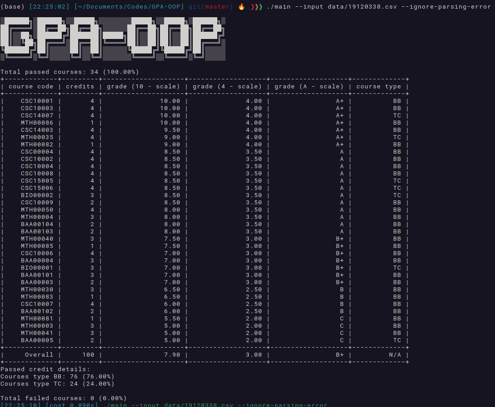

# GPA-OOP

Calculating my GPA, in an OOP way.

## Installation
Execute a `git clone`, then run `make` to compile.

For further information, visit [The Wiki page](https://github.com/khongsomeo/GPA-OOP/wiki).

## LICENSE
These works are under [The MIT License](LICENSE)
